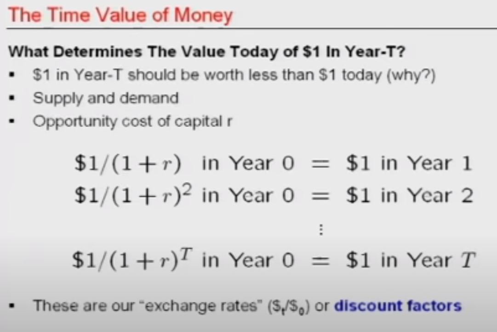

starts with an interesting example of Federal takeover of Fannie Mae and Freddie Mac
- these were/are 2 GSE (Gov-Supported entities) which were aiming to expand the mortgage/housing market by buying securities from banks (bank would give the loan for a house, and later would one of these companies buy that loan from the bank... ie, the money would go to them)

lecture starts around 19:30
# Present Value Relations - Critical Concepts
* Cashflows and Assets
* The Present Value Operator
* The Time Value Operator
* Special Cashflows: The Perpetuity
* Special Cashflows: The Annuity
* Compounding
* Inflation
* Extensions and Qualifications

## Cashflows and Assets
- What is an asset? From a business perspective, it is a sequence of cashflows. (it can be a factory but it can be something really hard to value, like an algorithm... stocks can also be assets)
- Patent is also an asset (patent is completely opposite to trading secret)
- it has an epxiry date, and after that date, everybody can take and reuse that knowledge... on the other hand, with trading secret you are not sharing what you know, but if somebody steals or rediscovers that stuff, you don't have any legal support
- brands have value too

The main definition is restated: The Asset is a sequence of (future) cashflows
- the asset is defined relative to the point in time (it is a sequence of (current and) future cashflows, not previous)
- cocacola now, and cocacola 20 yrs ago, and cocacola 100 years from now are different assets

- by cashflow professor means a particular sequence that occurs given market conditions (and asset is comprised of these cashflows)
- good question? do these cashflows need to be positive? NO. they don't (but they need to be real numbers)
- another good poitn: it is a sequence of cashflows... not their summation
- basically it is just a list of cashflows at diff points in the future (including present, but not past)
- and you don't need to know these numbers (especially in the future) but you need to acknowledge that they exist (and to abstract them in this manner)

eg, A Goodwill... that is the reputation shaped as an asset... and because customers choose you instead of competitors you generate additional cashflows
- in one company assets can share cashflows (which can flow accross different assets)
- the asset can also have value of 0

.. some content from presentation slides (mostly about that the value of assets is a function of its cashflows relative to the time)
	- an example he gives of value function is the market... or related to market (since it determines the value of the cashflows)
- important! same as two currencies can not be summed up (before using one as a standard and converting the other to that) two cashflows in different times are not the same and can not be simply summed
- this is really important... an example 350$ + 450€ is not equal to = 800 "something" ... we first need to convert either to euro or to dollar (we need to determine the base currency (ie numeraire) and the exchange rate first; and only then can we combine two things)... in the same way we need to consider cashflows in different time points (eg, 40$ is not same now and 50 years ago, they can't buy the same things)
- like we need to define base curr and exchange rate, the same idea holds for cashflows in diff points in time

- the exchange rates are sometimes called "discount factors"
- that is because they are typically values which are less than one
the exchange rate between previous and current cashflows is determined based on the financial markets
The power of the Financial Markets is the Wisdom of the Crowd

Once we figure the value of cashflows (its net present value) the management is trivial
- it enables us to make decisions: should you do this or not!?

Summary:
- We can value cashflows and assets (sequences of cashflows)
   - we value them by making some implicit assumptions
      1. we know cashflows in advance
      2. we know the exchange rates (from the market place)
      3. there is no friction in the currency conversion (ie, some fee for converting the currencies)
   - of course this is only hypothetical to understand how the model works with this simplifying assumptions

- The time Value of Money
  - 1$ today is usually more worth than 1$ in the future
    - ie, for the same amount of dollars today I can buy more stuff than in the future
  - supply & demand
    - more people want $ today
    - inflation as well
  - we can figure the difference (between $ today and $ tomorrow) by looking at exchange rates

  - if we have 1 $ in the future and want to figure its worth today, we need to multiply it with some number. that number is a discount (because it is less than 0)
    - and vice versa, if we want to figure out the worth of dollar today we need to multiply it (with some number which should probably be greater than 1)

  - Check picture: Opportunity Cost of the Capital
    - opportunity cost of the capital is also called interest rate, growth rate, cost of capital
    - the important is that it is reverse of the exchange rate that we were looking before when wanting to convert to todays $

