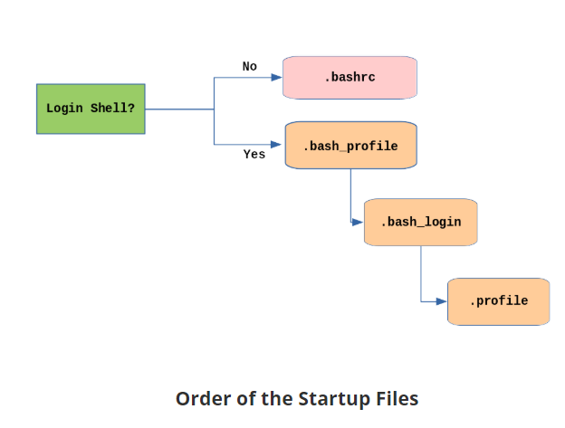

## Symbolic Links
Create symbolic link: `ln -s file1 file3`
`ls -li file1 file3`

Symbolic links take no extra space on the filesystem (unless their names are very long).
They can easily be modified to point to different places.
An easy way to create a shortcut from your home directory to long pathnames is to create a symbolic link.

Unlike hard links, soft links can point to objects even on different filesystems, partitions, and/or disks and other media, which may or may not be currently available or even exist.
In the case where the link does not point to a currently available or existing object, you obtain a dangling link.

# File Descriptors
When commands are executed, by default there are three standard file streams (or descriptors) always open for use: standard input (standard in or stdin), standard output (standard out or stdout) and standard error (or stderr).

File Descriptors, ie, Standard File Streams
- `stdin` (value/file-descriptor-code: `0`, e.g., keyboard)
- `stdout` (value/file-descriptor-code: `1`, e.g., terminal)
- `stderr` (value/file-descriptor-code: `2`, e.g., log file)

In Linux all open files are represented internally by what are called **file descriptors**.
Simply put, these are represented by numbers starting at zero.
`stdin` is file descriptor `0`, `stdout` is file descriptor `1`, and `stderr` is file descriptor `2`.
Typically, if other files are opened in addition to these three, which are opened by default, they will start at file descriptor 3 and increase from there.
- that means that also stdin/stderr/stoud are streams which are considered as open files

# Package Management system - Install Software & Packages
- 2 levels of package managers
  - dpkg - debian package manager (default low level package manager for debian and ubuntu)
  - apt - advanced package tool is higher-level package management system
- a low-level tool (such as **deb** or rpm)
  - a low-level tool (such as dpkg or rpm) takes care of the details of unpacking individual packages, running scripts, getting the software installed correctly
    - `dpkg --list | less (list all packages)`
    - `dpkg --listfiles bzip2 (show files of the package)`
- **apt** (high-level pacakge manager)
    - `sudo apt-cache search wget2`
  - while a high-level tool (such as apt-get, yum, dnf or zypper) works with groups of packages, downloads packages from the vendor, and figures out dependencies.

[diff between apt update and apt upgrade](https://www.youtube.com/watch?v=tNT9Hm8fpOA)

Most of the time users need to work only with the high-level tool, which will take care of calling the low-level tool as needed. Dependency resolution is a particularly important feature of the high-level tool, as it handles the details of finding and installing each dependency for you. Be careful, however, as installing a single package could result in many dozens or even hundreds of dependent packages being installed.

which vs whereis commands

`info make`
- utility to give information for apps in the system..
- ❓difference to man
- use n and p to scroll (n as next)
- http://www.differencebetween.net/technology/software-technology/difference-between-man-and-info/

# User Environment
`who -a` - currently logged in users
`whoami` - current user

The command shell program uses one or more **startup files** to **configure the user environment**.
- Files in the `/etc` directory define global settings for all users, while initialization files in the user's `home` directory can include and/or override the global settings.
- The startup files can do anything the user would like to do in every instance of the command shell, such as:
* Customizing the prompt
* Defining command line shortcuts and aliases
* Setting the default text editor
* Setting the path for where to find executable programs.

## Order of Startup Files
The standard prescription is that when you first login to Linux, `/etc/profile` is read and evaluated, after which the following files are searched (if they exist) in the listed order:
* `~/.bash_profile`
* `~/.bash_login`
* `~/.profile`
`~/.` denotes the user's home directory

The `Linux login shell` evaluates whatever startup file that it comes across first and ignores the rest. This means that if it finds ~/.bash_profile, it ignores ~/.bash_login and ~/.profile. Different distributions may use different startup files.

However, every time you create a new shell, or terminal window, etc., you do not perform a full system login; only a file named `~/.bashrc` file is read and evaluated.
Although this file is not read and evaluated along with the login shell, most distributions and/or users include the `~/.bashrc` file from within one of the three user-owned startup files.

Most commonly, users only fiddle with `~/.bashrc`, as it is invoked every time a new command line shell initiates, or another program is launched from a terminal window, while the other files are read and executed only when the user first logs onto the system.

Recent distributions sometimes do not even have .bash_profile or .bash_login (Ubuntu) and some just have it do little more than `include .bashrc`.

## Aliases
You can create customized commands or modify the behavior of already existing ones by creating aliases.
Most often, these aliases are placed in your `~/.bashrc` file so they are available to any command shells you create.
- `alias cmd1="echo $?"`
  - NO spaces around the equal sign and the alias definition needs to be placed within either single or double quotes if it contains any spaces.
- `alias` with no arguments will list currently defined aliases.
- `unalias` removes an alias.

# User Administration
**Users** have Unique ID (uid); integer; for normal users uid is > 1000
**Groups** are used for organizing users - collections of accounts with shared permissions; every group has gid
- `/etc/group` - shows a list of groups and their memebers
- default group has the same id as user's id
- can be found in /etc/passwd and /etc/group
- every user belongs to the default or primary group
- Groups are used to establish a set of users who have common interests for the purposes of access rights, privileges, and security considerations.
- Permissions on various files and dirs can be modified at the group level

To manage users on the system:
- `useradd` and `userdel` to add and del users
- `groupadd` and `groupdel` to add/del groups
- `id` - gives basic info about the user

- The `root` - superuser account
- you can use the `sudo` feature to assign more limited privileges to user accounts:
* Only on a temporary basis
* Only for a specific subset of commands.

When assigning elevated privileges, you can use the command `su` (switch or substitute user) to launch a new shell running as another user (you must type the password of the user you are becoming). Most often, this other user is root, and the new shell allows the use of elevated privileges until it is exited. It is **almost always** a bad (dangerous for both security and stability) practice to use `su` to become root. Resulting errors can include deletion of vital files from the system and security breaches.

Granting privileges using `sudo` is less dangerous and is preferred. By default, sudo must be enabled on a per-user basis. However, some distributions (such as Ubuntu) enable it by default for at least one main user, or give this as an installation option.

To execute just one command with root privilege type `sudo <command>`. When the command is complete, you will return to being a normal unprivileged user.

sudo configuration files are stored in the `/etc/sudoers` file and in the `/etc/sudoers.d/` directory. By default, the `sudoers.d` directory is empty.

By convention, most systems are set up so that the **root user** has a pound sign (`#`) as their prompt. Normal user will have `$`

# File Ownership & File Permissions
Files have three kinds of permissions: read (r), write (w), execute (x).
These are generally represented as in `rwx`. These permissions affect three groups of owners: user/owner (u), group (g), and others (o).

As a result, you have the following three groups of three permissions:
rwx: rwx: rwx
 u:   g:   o

- `chown` - change user ownership of a file or directory
- `chgrp`  - change group ownership
- `chmod` - change the permissions on the file, which can be done separately for owner, group and the rest of the world (often named as other)

This is done with a simple algorithm, and a single digit suffices to specify all three permission bits for each entity. This digit is the sum of:
- 4 if read permission is desired     [3rd bit]
- 2 if write permission is desired    [2nd bit]
- 1 if execute permission is desired. [1st bit]
Thus, 7 means read/write/execute, 6 means read/write, and 5 means read/execute.
When you apply this to the chmod command, you have to give three digits for each degree of freedom, such as in:

- `$ chmod 755 somefile` - change permissions
- `ls -l somefile` - check permissions

# Summary
The root account has full access to the system. It is never sensible to grant full root access to a user.
You can assign root privileges to regular user accounts on a temporary basis using the `sudo` command.
The shell program (bash) uses multiple startup files to create the user environment. Each file affects the interactive environment in a different way.
`/etc/profile` provides the global settings.
Advantages of startup files include that they customize the user's prompt, set the user's terminal type, set the command-line shortcuts and aliases, and set the default text editor, etc.
An environment variable is a character string that contains data used by one or more applications. The built-in shell variables can be customized to suit your requirements.
The history command recalls a list of previous commands, which can be edited and recycled.
In Linux, various keyboard shortcuts can be used at the command prompt instead of long actual commands.
You can customize commands by creating aliases. Adding an alias to ˜/.bashrc will make it available for other shells.
File permissions can be changed by typing chmod permissions filename.
File ownership is changed by typing chown owner filename.
File group ownership is changed by typing chgrp group filename.

# Regular Expressions and Search Patterns
Regular expressions are text strings used for matching a specific pattern, or to search for a specific location, such as the start or end of a line or a word. Regular expressions can contain both normal characters or so-called meta-characters, such as * and $.

Many text editors and utilities such as vi, sed, awk, find and grep work extensively with regular expressions. Some of the popular computer languages that use regular expressions include Perl, Python and Ruby. It can get rather complicated and there are whole books written about regular expressions; thus, we will do no more than skim the surface here.

These regular expressions are different from the wildcards (or meta-characters) used in filename matching in command shells such as bash (which were covered in Chapter 7: Command-Line Operations). The table lists search patterns and their usage.
.(dot)	Match any single character
a|z	Match a or z
$	Match end of string
^	Match beginning of string
"*"	Match preceding item 0 or more times

strings is used to extract all printable character strings found in the file or files given as arguments. It is useful in locating human-readable content embedded in binary files; for text files one can just use grep.

For example, to search for the string my_string in a spreadsheet:

$ strings book1.xls | grep my_string

text utilities that you can use for performing various actions on your Linux files, such as changing the case of letters or determining the count of words, lines, and characters in a file.

**tr**
The tr utility is used to translate specified characters into other characters or to delete them. The general syntax is as follows:

$ tr [options] set1 [set2]

The items in the square brackets are optional. tr requires at least one argument and accepts a maximum of two. The first, designated set1 in the example, lists the characters in the text to be replaced or removed. The second, set2, lists the characters that are to be substituted for the characters listed in the first argument. Sometimes these sets need to be surrounded by apostrophes (or single-quotes (')) in order to have the shell ignore that they mean something special to the shell. It is usually safe (and may be required) to use the single-quotes around each of the sets as you will see in the examples below.

For example, suppose you have a file named city containing several lines of text in mixed case. To translate all lower case characters to upper case, at the command prompt type cat city | tr a-z A-Z and press the Enter key.

Command	Usage
$ tr abcdefghijklmnopqrstuvwxyz ABCDEFGHIJKLMNOPQRSTUVWXYZ	Convert lower case to upper case
$ tr '{}' '()' < inputfile > outputfile	Translate braces into parenthesis
$ echo "This is for testing" | tr [:space:] '\t'	Translate white-space to tabs
$ echo "This   is   for    testing" | tr -s [:space:]
Squeeze repetition of characters using -s
$ echo "the geek stuff" | tr -d 't'	Delete specified characters using -d option
$ echo "my username is 432234" | tr -cd [:digit:]	Complement the sets using -c option
$ tr -cd [:print:] < file.txt	Remove all non-printable character from a file
$ tr -s '\n' ' ' < file.txt	Join all the lines in a file into a single line

tee takes the output from any command, and, while sending it to standard output, it also saves it to a file. In other words, it "tees" the output stream from the command: one stream is displayed on the standard output and the other is saved to a file.

For example, to list the contents of a directory on the screen and save the output to a file, at the command prompt type ls -l | tee newfile and press the Enter key.

cut
cut is used for manipulating column-based files and is designed to extract specific columns. The default column separator is the tab character. A different delimiter can be given as a command option.

For example, to display the third column delimited by a blank space, at the command prompt type ls -l | cut -d" " -f3 and press the Enter key.

# Creating Temporary Files and Directories

Temporary files (and directories) are meant to store data for a short time.
These files should disappear when the program using them terminates.
`touch` is not the best option to create a temporary file, since it can make it easy for hackers to gain access to your data.
This is particularly true if the name and the file location of the temporary file are predictable.

The best practice is to create **random and unpredictable filenames** for temporary storage.
One way to do this is with the `mktemp` utility, as in the following examples.

Command	Usage
- The XXXXXXXX is replaced by the mktemp utility with random characters to ensure the name of the temporary file cannot be easily predicted and is only known within your program.
- Create a temporary file: `TEMP=$(mktemp /tmp/tempfile.XXXXXXXX)`
- Create a temporary directory: `TEMPDIR=$(mktemp -d /tmp/tempdir.XXXXXXXX)`

# Discarding Output with /dev/null
Certain commands (like find) will produce voluminous amounts of output, which can overwhelm the console. To avoid this, we can redirect the large output to a special file (a device node) called /dev/null. This pseudofile is also called the bit bucket or black hole.

All data written to it is discarded and write operations never return a failure condition. Using the proper redirection operators, it can make the output disappear from commands that would normally generate output to stdout and/or stderr:

random numbers can be generated by using the $RANDOM environment variable

The default display manager for GNOME is gdm
- presents user with the login screen
- Logging out through the desktop env kills all the processes in your current X session and returns to the display manager login screen
Suspending puts the computer in sleep mode

Network Time Protocol NTP - protocol for setting the locale time via Internet Servers

`xdpyinfo` gives basic info about display
- e.g., `xdypinfo | grep dim` - print the resolution

Absolute path starts with "/"

tree - list files&dirs in tree shape
tree - d : only show directories

[Missing Semester - Cambridge, 2020](https://www.youtube.com/playlist?list=PLyzOVJj3bHQuloKGG59rS43e29ro7I57J)

xargs takes the lines of input and turns them into arguments

# MISC
In most UNIX systems logs are usually stored in `/var/log`
- eg, `/var/log/system.log` a lot of info about OS
- `/var/log/system.log | lnav` check this tool for reading logs
- another tool is `log show --last 10s`
`logger` command can be used to print log statements into log files
`strace` is the tool which will help you to check what of system calls are made when executing some application or some script
- system calls are the calls made to OS (which OS needs to do/delgate) like network calls, reading a file, ...
- `strace -e lstat ls -l` lstat flag lists the properties of files ... something like that

you can integrate vim with some linting tools... so that you see the errors in the same way you see them in the vscode.

- Printing: CUPS
- PDF Manipulation: `qpdf`  is widely available on Linux distributions and is very full-featured.
- encrypt pdfs: `pdftk`
The CUPS interface is available at http://localhost:631.
lp and lpr are used to submit a document to CUPS directly from the command line.
lpoptions can be used to set printer options and defaults.
PostScript effectively manages scaling of fonts and vector graphics to provide quality prints.
enscript is used to convert a text file to PostScript and other formats.
Portable Document Format (PDF) is the standard format used to exchange documents while ensuring a certain level of consistency in the way the documents are viewed.
pdftk joins and splits PDFs; pulls single pages from a file; encrypts and decrypts PDF files; adds, updates, and exports a PDF’s metadata; exports bookmarks to a text file; adds or removes attachments to a PDF; fixes a damaged PDF; and fills out PDF forms.
pdfinfo can extract information about PDF documents.
flpsed can add data to a PostScript document.
pdfmod is a simple application with a graphical interface that you can use to modify PDF documents.
