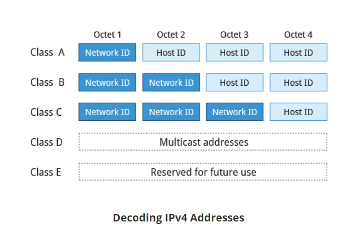

# Networking
Decoding IPv4 Addresses
A 32-bit IPv4 address is divided into four 8-bit sections called octets (bytes).
Example:
IP address →            172  .          16  .          31  .         46
Bit format →     10101100.00010000.00011111.00101110

Network addresses are divided into five classes: A, B, C, D and E. Classes A, B and C are classified into two parts: Network addresses (Net ID) and Host address (Host ID). The Net ID is used to identify the network, while the Host ID is used to identify a host in the network. Class D is used for special multicast applications (information is broadcast to multiple computers simultaneously) and Class E is reserved for future use. In this section you will learn about classes A, B and C.

You can assign IP addresses to computers over a network either manually or dynamically. Manual assignment adds static (never changing) addresses to the network. Dynamically assigned addresses can change every time you reboot or even more often; the Dynamic Host Configuration Protocol (DHCP) is used to assign IP addresses.

Name Resolution is used to convert numerical IP address values into a human-readable format known as the hostname. For example, 104.95.85.15 is the numerical IP address that refers to the hostname whitehouse.gov. Hostnames are much easier to remember!

Given an IP address, you can obtain its corresponding hostname. Accessing the machine over the network becomes easier when you can type the hostname instead of the IP address.

You can view your system’s hostname simply by typing hostname with no argument.

Note: If you give an argument, the system will try to change its hostname to match it, however, only root users can do that.

The special hostname localhost is associated with the IP address 127.0.0.1, and describes the machine you are currently on (which normally has additional network-related IP addresses).

 Domain Name System (DNS) translates Internet domain and host names to IP addresses.

For Debian family configurations, the basic network configuration files could be found under /etc/network/

## Network Interfaces
Network interfaces are a connection channel between a device and a network. Physically, network interfaces can proceed through a network interface card (NIC), or can be more abstractly implemented as software. You can have multiple network interfaces operating at once. Specific interfaces can be brought up (activated) or brought down (de-activated) at any time.

Information about a particular network interface or all network interfaces can be reported by the ip and ifconfig utilities, which you may have to run as the superuser, or at least, give the full path, i.e. /sbin/ifconfig, on some distributions. ip is newer than ifconfig  and has far more capabilities, but its output is uglier to the human eye.

- To view the IP address: `$ /sbin/ip addr show`
- To view the routing information: `$ /sbin/ip route show`

ip is a very powerful program that can do many things. Older (and more specific) utilities such as ifconfig and route are often used to accomplish similar tasks. A look at the relevant man pages can tell you much more about these utilities.

ping is used to check whether or not a machine attached to the network can receive and send data; i.e. it confirms that the remote host is online and is responding.

To check the status of the remote host, at the command prompt, type ping <hostname>.

ping is frequently used for network testing and management; however, its usage can increase network load unacceptably. Hence, you can abort the execution of ping by typing CTRL-C, or by using the -c option, which limits the number of packets that ping will send before it quits. When execution stops, a summary is displayed.

A network requires the connection of many nodes. Data moves from source to destination by passing through a series of routers and potentially across multiple networks. Servers maintain routing tables containing the addresses of each node in the network. The IP routing protocols enable routers to build up a forwarding table that correlates final destinations with the next hop addresses.

One can use the route utility or the newer ip route command to view or change the IP routing table to add, delete, or modify specific (static) routes to specific hosts or networks. The table explains some commands that can be used to manage IP routing:

Show current routing table	`$ route –n or ip route`
Add static route	$ route add -net address or ip route add
Delete static route	$ route del -net address or ip route del

traceroute is used to inspect the route which the data packet takes to reach the destination host, which makes it quite useful for troubleshooting network delays and errors. By using traceroute, you can isolate connectivity issues between hops, which helps resolve them faster.

To print the route taken by the packet to reach the network host, at the command prompt, type traceroute <address>.

additional tools
`ethtool`	Queries network interfaces and can also set various parameters such as the speed
netstat	Displays all active connections and routing tables. Useful for monitoring performance and troubleshooting
nmap	Scans open ports on a network. Important for security analysis
tcpdump	Dumps network traffic for analysis
iptraf	Monitors network traffic in text mode
mtr	Combines functionality of ping and traceroute and gives a continuously updated display
dig	Tests DNS workings. A good replacement for host and nslookup

# FTP
When you are connected to a network, you may need to transfer files from one machine to another. File Transfer Protocol (FTP) is a well-known and popular method for transferring files between computers using the Internet. This method is built on a client-server model. FTP can be used within a browser or with stand-alone client programs.

FTP is becoming replaced in favor of using rsync and web browser https access for example. As an alternative, sftp is a very secure mode of connection, which uses the Secure Shell (ssh) protocol, which we will discuss shortly. sftp encrypts its data and thus sensitive information is transmitted more securely. However, it does not work with so-called anonymous FTP (guest user credentials).

# ssh
Secure Shell (SSH) is a cryptographic network protocol used for secure data communication. It is also used for remote services and other secure services between two devices on the network and is very useful for administering systems which are not easily available to physically work on, but to which you have remote access.

To login to a remote system using your same user name you can just type ssh some_system and press Enter. ssh then prompts you for the remote password. You can also configure ssh to securely allow your remote access without typing a password each time.

If you want to run as another user, you can do either ssh -l someone some_system or ssh someone@some_system. To run a command on a remote system via SSH, at the command prompt, you can type ssh some_system my_command.

Copying files securely with scp
We can also move files securely using Secure Copy (scp) between two networked hosts. scp uses the SSH protocol for transferring data.

To copy a local file to a remote system, at the command prompt, type scp <localfile> <user@remotesystem>:/home/user/ and press Enter.

You will receive a prompt for the remote password. You can also configure scp so that it does not prompt for a password for each transfer.

Summary
The IP (Internet Protocol) address is a unique logical network address that is assigned to a device on a network.
IPv4 uses 32-bits for addresses and IPv6 uses 128-bits for addresses.
Every IP address contains both a network and a host address field.
There are five classes of network addresses available: A, B, C, D & E.
DNS (Domain Name System) is used for converting Internet domain and host names to IP addresses.
The ifconfig program is used to display current active network interfaces.
The commands ip addr show and ip route show can be used to view IP address and routing information.
You can use ping to check if the remote host is alive and responding
You can use the route utility program to manage IP routing.
You can monitor and debug network problems using networking tools.
Firefox, Google Chrome, Chromium, and Epiphany are the main graphical browsers used in Linux.
Non-graphical or text browsers used in Linux are Lynx, Links, and w3m.
You can use wget to download webpages.
You can use curl to obtain information about URLs.
FTP (File Transfer Protocol) is used to transfer files over a network.
ftp, sftp, ncftp, and yafc are command line FTP clients used in Linux.
You can use ssh to run commands on remote systems.
