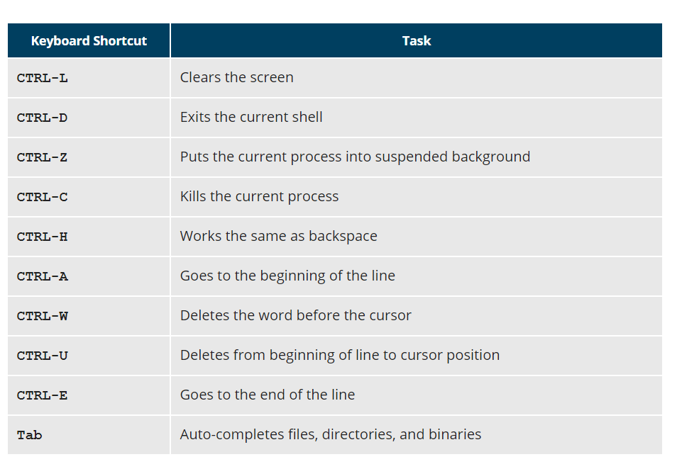

Based on the ed-x course and the missing-semester lecture
(get the link of the missing-semester lecture)

# Shell Scripting [From the missing semester]

globbing essentially refers to expansions (you can use * and ? and {} and any of their combination)
- all files with .sh expansion for example `ls *.sh`
- `ls project?` will expand to a single character (* is any no of characters)
- `gpg image.jpg image.png` same as `gpg image.{jpg,png}`
  - once again NO SPACES (spaces are reserved for separating arguments)
  - `touch foo{1,2,10}`

`diff` tool to compare for us diffs between folders or files

source is really important
- sometime if you run directly the script... some side effect like cd or setting env variables will not work ,but will work if you load that file into the current shell using `source`

`tldr` install it... it is like tldr version of man pages
- there is also VS Code plugin for that

# Shell/Bash scripting
- an example of bash script is stored in gist missing_semester

`foo=bar` - define variable
`$foo` - access variable
- if you use strings as value of env var use quotes (eg, VAR1="Hellow World")
`foo=$(mcd)` - store output of command mcd into variable foo

## Execute Scripts
`chmod +x hello.sh` makes the file executable by all users.

Enables to run the script using `./hello.sh` or `bash hello.sh`
- Note: If you use the second form, you do not have to make the file executable.

All shell scripts generate a **return value** upon finishing execution, which can be explicitly set with the **exit statement**.
Return values permit a process to monitor the exit state of another process, often in a parent-child relationship.
Knowing how the process terminates enables taking any appropriate steps which are necessary or contingent on success or failure.

- space is reserved for seprating arguments! (ie, NO space between environmental var and its value)

- double qoutes string does string interpolation: `echo "value is $foo"`
- ❗ single quotes do not do that... they print the content as an actual string

## Exit Codes (Or Signals)
Eg, execute `ls` on a file that exists as well as one that does not, the **return value** is stored in the **environment variable represented by $?**?
`echo $?`
Applications often translate these return values into meaningful messages easily understood by the user.

- `true` has 0 exit code... `false` has 1 exit code
`0` - everything fine
`1` - there was a problem

## Language Constructs

`#`	Used to add a comment, except when used as `\#`, or as `#!` when starting a script
`\`	Used at the end of a line to indicate continuation on to the next line
`;`	Used to interpret what follows as a new command to be executed next
- eg, `make ; make install ; make clean`
- use to concatenate commands (it is not like pipe since it does not pass the output, just concatenation of their execution)
`$`	Indicates what follows is an environment variable

`echo $(date)` ❓

### I/O Redirection
https://www.techrepublic.com/article/how-to-run-multiple-linux-commands-from-one-line/

if the command do_something reads from stdin we can change its input source
`do_something < input-file`

if you want to change the target of the output and to send it to a file
`do_something > output-file`

if you want to change the target of the stderr and to send it to a file
 `do_something 2> error-file`

 `do_something >& all-output-file`
 (prints both stdout and stderr to same file)

 on the other hands pipes "|" are used to make output of one command the input of the other command

 The UNIX/Linux philosophy is to have many simple and short programs (or commands) cooperate together to produce quite complex results,
 rather than have one complex program with many possible options and modes of operation.
 that is why pipes are important
 command1 | command2 | command3

 The above represents what we often call a pipeline, and allows Linux to combine the actions of several commands into one. This is extraordinarily efficient because command2 and command3 do not have to wait for the previous pipeline commands to complete before they can begin hacking at the data in their input streams; on multiple CPU or core systems, the available computing power is much better utilized and things get done quicker.
 Furthermore, there is no need to save output in (temporary) files between the stages in the pipeline, which saves disk space and reduces reading and writing from disk, which is often the slowest bottleneck in getting something done.


redirect standard input: `do_something < input-file`
redirect standard output: `do_something > output-file` (or `do_something 1> output-file`)
redirect standard error: `do_something 2> output-file`
redirect both standard output and error: `do_something >& all-output-file` (shorthand notation for: `do_something > all-output-file 2>&1`)

**Pipes**
`command1 | command2 | command3`

A **pipeline** allows Linux to combine the actions of several commands into one. This is extraordinarily efficient because command2 and command3 do not have to wait for the previous pipeline commands to complete before they can begin hacking at the data in their input streams; on multiple CPU or core systems, the available computing power is much better utilized and things get done quicker.

Furthermore, there is no need to save output in (temporary) files between the stages in the pipeline, which saves disk space and reduces reading and writing from disk, which is often the slowest bottleneck in getting something done.

https://thoughtbot.com/blog/input-output-redirection-in-the-shell

`>`	Redirect output
`>>`	Append output
`<`	Redirect input
`|`	Used to pipe the result into the next command

### Logical Operators
`&&` logical AND
- However, you may want to abort subsequent commands when an earlier one fails. You can do this using the && (AND) operator as in:
- `$ make && make install && make clean`
- If the first command fails, the second one will never be executed.

`||` logical OR
- A final refinement is to use the || (or) operator, as in:
`$ cat file1 || cat file2 || cat file3`
- In this case, you proceed until something succeeds and then you stop executing any further steps

There are other special characters and character combinations and constructs that scripts understand, such as `{..}`, `[..]`,`$((...))`

`falls || echo "Ooops fail"` ("or" operator)
`falls && echo "Ooops fail"` ("and" operator)

### Bash Built-In Commands
In addition, bash has many built-in commands, which can only be used to display the output within a terminal shell or shell script.
Sometimes, these commands have the same name as executable programs on the system, such as `echo` which can lead to subtle problems.
bash built-in commands include and `cd`, `pwd`, `echo`, `read`, `logout`, `printf`, `let`, and `ulimit`.
Thus, slightly different behavior can be expected from the built-in version of a command such as `echo` as compared to `/bin/echo`.

A complete list of bash built-in commands can be found in the `bash man` page, or by simply typing help

# Script Parameters
Users often need to pass parameter values to a script, such as a filename, date, etc.
Scripts will take different paths or arrive at different values according to the parameters (command arguments) that are passed to them.
These values can be text or numbers as in:

`$ ./script.sh /tmp`
`$ ./script.sh 100 200`

Within a script, the parameter or an argument is represented with a `$ and a number` or special character.
The table lists some of these parameters.

`$0`  the Script name
`$1` the first argument
`$2, $3, etc`	Second, third parameter, etc.
`$*`	All parameters
`$#`	Number of arguments given to the command

#### Other Specials
`$?` - gives the error code from the previous command
`$_` - givest the last argument of the previous command
`$$` - pid of the command
`$@` - expands to all arguments (array of arguments (used commonly in loops))

At times, you may need to substitute the result of a command as a portion of another command. It can be done in two ways:

* By enclosing the inner command in `$( )`
* By enclosing the inner command with backticks (`)

example: `ls /lib/modules/$(uname -r)/`
- the output of the command `uname –r` (which will be something like 4.18.2) is inserted into the argument for the `ls` command.

## Functions
The function declaration requires a name which is used to invoke it. The proper syntax is:

```bash
    function_name () {
       command...
    }
```
For example, the following function is named display:

```bash
    display () {
       echo "This is a sample function"
    }
```

## If Statements

```bash
if condition
then
       statements
elif [ somothertest ] ; then
    echo statements
else
       statements
fi
```

```bash
if [ -f "$1" ]
then
    echo file "$1 exists"
else
    echo file "$1" does not exist
fi
```
### boolean expressions
`&&`	AND	The action will be performed only if both the conditions evaluate to true.
`||`	OR	The action will be performed if any one of the conditions evaluate to true.
`!`	NOT	The action will be performed only if the condition evaluates to false.

### numerical tests

`-eq`	Equal to
`-ne`	Not equal to
`-gt`	Greater than
`-lt`	Less than
`-ge`	Greater than or equal to
`-le`	Less than or equal to

`exp1 -op exp2`
eg, `3 -eq 4` ("3 == 4"; returns false)


# Source

create a file `mcd.sh`
```bash
mcd () {
  mkdir -p "$1"
  cd "$1"
}
```

`source mcd.sh` will load the file into our current bash instance (so that we can run function directly)

this is a big difference between `source script.sh` and `./script.sh`
- this will essentially execute the bash script in completely new (sub)shell and if you do some stuff like change directories (ie `cd ...`) and similar... that will not be saved once the script is done (ie, it will still be the same dir once the script is finished)
- on the other hand source will load the code of the script into the current shell
- additionally, if we define functions and want to use them in the current shell session, then `source ` is the right approach
- source both loads (into the current shell) and runs the script


# Env Variables

$PATH - an ordered list of coma-separated directories (the path) which is scanned when a command is given to find the appropriate program or script to run. Each directory in the path is separated by colons (:). A null (empty) directory name (or ./) indicates the current directory at any given time.
`:path1:path2`, `path1::path2`
In the example `:path1:path2`, there is a null directory before the first colon (:). Similarly, for `path1::path2` there is a null directory between path1 and path2.

list of places where the shell is going to look for the applications/binaries

To prefix a private bin directory to your path:

`export PATH=$HOME/bin:$PATH`
`echo $PATH` -> `/home/student/bin:/usr/local/bin:/usr/bin:/bin/usr`

default shell `$SHELL`

history env variables
- HISTFILE, HISTFILESIZE, HISTSIZE, HISTCONTROL, HISTIGNORE
`!!` bang-bang executes previous command
CTRL-R - search previously used commands

`!` - start a history substitution
`!$` - refer to last argument in line
`!n` refer to nth command line
!string - refer to most recent command starting with string

# Env Variables

eg, `$HOME` - - login directory of the user (~ used as abbreviation for HOME)
Some environment variables are given preset values by the system (which can usually be overridden), while others are set directly by the user, either at the command line or within startup and other scripts.

An environment variable is actually just a character string that contains information used by one or more applications. There are a number of ways to view the values of currently set environment variables; one can type set, `env`, or `export`. Depending on the state of your system, `set` may print out many more lines than the other two methods.

By default, variables created within a script are only available to the current shell; child processes (sub-shells) will not have access to values that have been set or modified. Allowing child processes to see the values requires use of the export command.

show value of specific env - echo $SHELL
export new variable - export VARIABLE=value (or VARIABLE=value; export VARIABLE)
add value permanently -
  1. edit ~/.bashrc and add line export VARIABLE=value
  2. source ~/.bashrc (or type bash) to restart shell
for one line command you can add env variables in front of command
  - eg., `HAUS=miki echo $HAUS`

`cd` changes pwd to home dir

https://dev.to/yashsugandh/history-command-and-how-to-use-it-37k8



