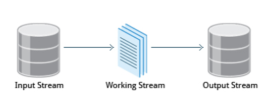

- this will be suspectable to change. Still trying to figure if it makes to group all tools in one place or cluster them based on utility.
- eg, text manipulation tools; that will also make more sense since I could explain some common regex stuff there.

# Virtual Terminals & Terminal Multiplexer
Virtual Terminals--- they are started when you run the system
Ctrl - Alt - F1 - this is

sudo systemctl stop gdm
sudo systemctl start gdm
- use this commands to start and stop Graphical UI on linux

[TMUX](https://hackaday.com/2020/05/01/linux-command-line-productivity-with-tmux/)

3 Core Concepts:
1. Sessions
2. Windows (belong to Sesssions) ~= Tabs in other Applications
3. Panes (part of Windows)

## Terminal Colors
`printf "\e[38;2;255;0;0m This is red \e[0m"`
- it will print "This is red" in the red color... in general this is how you send the colors to the shell

Note: Using ANSI escape sequences for color is fine most of the time (since nearly all terminal emulators use the XTerm scheme for 8-bit color control), but directly using ANSI escape sequences to control a terminal emulator is often a mistake.
There is a UNIX library called `<curses.h>`, which parses terminfo usually to ascertain what capabilities your current terminal possesses (based on the `$TERM` env var).
This should be preferred if you're trying to control the display (such as colors) or cursor (such as supporting the `<Home>` key or moving the cursor). `Curses` basically allows your programs to support all terminals whose terminfo file is properly installed and configured and should, therefore, be used in applications that are used by more than one individual. If you have a complex program with a logging system, this is almost certainly the case.

# Displaying Text
## echo
`echo` displays echoes text
The –e option, along with the following switches, is used to enable special character sequences, such as the newline character or horizontal tab.

`\n`  represents newline
`\t`  represents horizontal tab.
`echo string > newfile`	The specified string is placed in a new file
`echo string >> existingfile`	The specified string is appended to the end of an already existing file
`echo $variable`	The contents of the specified environment variable are displayed

# How to search for files
`find` and `locate` are commands used to search for files

`locate` - performs a database search to find all file names that match a given pattern.
`find` - locates files recursively from a given directory or set of directories.

The locate utility program performs a search taking advantage of a previously constructed database of files and directories on your system, matching all entries that contain a specified character string. This can sometimes result in a very long list.

To get a shorter (and possibly more relevant) list, we can use the `grep` program as a filter.

When no arguments are given, `find` lists all files in the current directory and all of its subdirectories. Commonly used options to shorten the list include -name (only list files with a certain pattern in their name), -iname (also ignore the case of file names), and -type (which will restrict the results to files of a certain specified type, such as d for directory, l for symbolic link, or f for a regular file, etc.).
  `find /usr -name gcc`
  `find /usr -type d -name gcc`
    - d for directory, l for symbolic link, or f for a regular file, etc
  - Another good use of find is being able to run commands on the files that match your search criteria. The -exec option is used for this purpose.
  - `find -name "*.swp" -exec rm {} ’;’`
    - The {} (squiggly brackets) is a placeholder that will be filled with all the file names that result from the find expression, and the preceding command will be run on each one individually.
    - ";" or "\;" needs to be added to end the command
  - `find / -ctime 3`
    - -ctime is when the inode metadata (i.e. file ownership, permissions, etc.) last changed; it is often, but not necessarily, when the file was first created. You can also search for accessed/last read (-atime) or modified/last written (-mtime) times. The number is the number of days and can be expressed as either a number (n) that means exactly that value, +n, which means greater than that number, or -n, which means less than that number. There are similar options for times in minutes (as in -cmin, -amin, and -mmin).
  - find / -size 0
    - Note the size here is in 512-byte blocks, by default; you can also specify bytes (c), kilobytes (k), megabytes (M), gigabytes (G), etc. As with the time numbers above, file sizes can also be exact numbers (n), +n or -n.

## Wildcards Matching File Names
- search for a filename containing specific characters using wildcards
- `?` - any single character
- `*` - any string of characters
- `[set]`- any character in the set of characters, eg, `[abc]`
- `[!set]` - any character that is not in the set of characters, eg, `[!abc]`

## find

To find and remove all files that end with .swp:
`find -name "*.swp" -exec rm {} ’;’`

The `{}` (squiggly brackets) is a placeholder that will be filled with all the file names that result from the find expression, and the preceding command will be run on each one individually.
The command needs to end with either `‘;’` (including the single-quotes) or `\;`. Both forms are fine.
One can also use the `-ok` option, which behaves the same as `-exec`, except that find will prompt you for permission before executing the command. This makes it a good way to test your results before blindly executing any potentially dangerous commands.

find can also search based on time
`-ctime` (last changed/created)
`-atime` (last accessed)
`-mtime` (last modified)

or based on size
`find / -size +10M -exec comand {} ';'`

## locate
- The locate utility program performs a search taking advantage of a previously constructed database of files and directories on your system, matching all entries that contain a specified character string.
  - used with grep usually `locate zip | grep bin`
  - locate utilizes a database created by a related utility, updatedb. Most Linux systems run this automatically once a day. However, you can update it at any time by just running updatedb from the command line as the root user.

## diff
`diff` tool to compare files (diff3 for comparing 3 files)
- ⭐ meld is probably better option than diff [meld](https://opensource.com/article/20/3/meld)
- kdiff3 as well (it can be used to compare folders and up to 3 files)
  - https://www.ghacks.net/2020/02/28/kdiff3-is-an-open-source-file-comparison-and-merge-tool/

diff flags
-c  Provides a listing of differences that include three lines of context before and after the lines differing in content
-r	Used to recursively compare subdirectories, as well as the current directory
-i	Ignore the case of letters
-w	Ignore differences in spaces and tabs (white space)
-q	Be quiet: only report if files are different without listing the differences
diff is meant to be used for text files; for binary files, one can use cmp.

- https://www.computerhope.com/unix/ucomm.htm

## patch
Many modifications to source code and configuration files are distributed utilizing patches, which are applied, not surprisingly, with the patch program. A patch file contains the deltas (changes) required to update an older version of a file to the new one. The patch files are actually produced by running diff with the correct options, as in:

$ diff -Nur originalfile newfile > patchfile

Distributing just the patch is more concise and efficient than distributing the entire file. For example, if only one line needs to change in a file that contains 1000 lines, the patch file will be just a few lines long.
To apply a patch, you can just do either of the two methods below:

$ patch -p1 < patchfile
$ patch originalfile patchfile
The first usage is more common, as it is often used to apply changes to an entire directory tree, rather than just one file, as in the second example. To understand the use of the -p1 option and many others, see the man page for patch.

## utility
For the file names given as arguments, it examines the contents and certain characteristics to determine whether the files are plain text, shared libraries, executable programs, scripts, or something else.

## wc
`wc` (word count) counts the number of lines, words, and characters in a file or list of files. Options are given in the table below.

Option	Description
`–l`	Displays the number of lines
`-c`	Displays the number of bytes
`-w`	Displays the number of words

# Working with Files & Text

## split

split is used to break up (or split) a file into equal-sized segments for easier viewing and manipulation, and is generally used only on relatively large files. By default, split breaks up a file into 1000-line segments. The original file remains unchanged, and a set of new files with the same name plus an added prefix is created. By default, the x prefix is added. To split a file into segments, use the command split infile.
To split a file into segments using a different prefix, use the command split infile <Prefix>.

## grep

grep is extensively used as a primary text searching tool. It scans files for specified patterns and can be used with regular expressions, as well as simple strings, as shown in the table:

`grep [pattern] <filename>`	Search for a pattern in a file and print all matching lines
`grep -v [pattern] <filename>`	Print all lines that do not match the pattern
`grep [0-9] <filename>`	Print the lines that contain the numbers 0 through 9
`grep -C 3 [pattern] <filename>`	Print context of lines (specified number of lines above and below the pattern) for matching the pattern. Here, the number of lines is specified as 3

# Manipulating Text
cat - short for concatenate
- read and print files
- `cat <filename>`
- tac prints text in reverse order
- cat file1 file2	Concatenate multiple files and display the output; i.e. the entire content of the first file is followed by that of the second file
- cat file1 file2 > newfile
- cat file >> existingfile
Using cat interactively
cat > file	Any subsequent lines typed will go into the file, until CTRL-D is typed
cat >> file	Any subsequent lines are appended to the file, until CTRL-D is typed

## sed and awk
- to create and then repeatedly edit and/or extract contents from a file
sed - stream editor - used to modify the contents of a file, usually placing the contents into a new file.

sed can filter text, as well as perform substitutions in data streams.

How it works: Data from an input source/file (or stream) is taken and moved to a working space. The entire list of operations/modifications is applied over the data in the working space and the final contents are moved to the standard output space (or stream).

`sed -e command <filename>`
The -e command option allows you to specify multiple editing commands simultaneously at the command line. It is unnecessary if you only have one operation invoked.
`sed -f scriptfile <filename>`

sed s/pattern/replace_string/ file	Substitute first string occurrence in every line
sed s/pattern/replace_string/g file	Substitute all string occurrences in every line
sed 1,3s/pattern/replace_string/g file	Substitute all string occurrences in a range of lines
sed -i s/pattern/replace_string/g file	Save changes for string substitution in the same file (i.e, update the file with changes)

It is always safer to use sed without the –i option and then replace the file yourself, as shown in the following example:

$ sed s/pattern/replace_string/g file1 > file2

awk is used to extract and then print specific contents of a file and is often used to construct reports.
it is interpreted programming language.
It works well with fields (containing a single piece of data, essentially a column) and records (a collection of fields, essentially a line in a file).

As with sed, short awk commands can be specified directly at the command line, but a more complex script can be saved in a file that you can specify using the -f option.

awk ‘command’  file	Specify a command directly at the command line
awk -f scriptfile file	Specify a file that contains the script to be executed

awk '{ print $0 }' /etc/passwd	Print entire file
awk -F: '{ print $1 }' /etc/passwd	Print first field (column) of every line, separated by a space
awk -F: '{ print $1 $7 }' /etc/passwd	Print first and seventh field of every line

The input file is read one line at a time, and, for each line, awk matches the given pattern in the given order and performs the requested action. The -F option allows you to specify a particular field separator character. For example, the /etc/passwd file uses ":" to separate the fields, so the -F: option is used with the /etc/passwd file.

The command/action in awk needs to be surrounded with apostrophes (or single-quote (')). awk can be used as follows:

In managing your files, you may need to perform many tasks, such as sorting data and copying data from one location to another. Linux provides several file manipulation utilities that you can use while working with text files. In this section, you will learn about the following file manipulation programs:

# sort & uniq
sort is used to rearrange the lines of a text file either in ascending or descending order, according to a sort key. You can also sort by particular fields of a file. The default sort key is the order of the ASCII characters (i.e. essentially alphabetically).

sort can be used as follows:
`sort <filename>`	Sort the lines in the specified file, according to the characters at the beginning of each line
`cat file1 file2 | sort`	Combine the two files, then sort the lines and display the output on the terminal
sort -r <filename>	Sort the lines in reverse order
sort -k 3 <filename>	Sort the lines by the 3rd field on each line instead of the beginning
When used with the -u option, sort checks for unique values after sorting the records (lines). It is equivalent to running uniq (which we shall discuss) on the output of sort.

`sort file1 file2 | uniq > file3`
`uniq -c filename`  - count the number of duplicate entries
paste
 You want to create a new file that contains all the data listed in three columns: name, employee ID, and phone number. How can you do this effectively without investing too much time?

paste can be used to create a single file containing all three columns. The different columns are identified based on delimiters (spacing used to separate two fields). For example, delimiters can be a blank space, a tab, or an Enter. In the image provided, a single space is used as the delimiter in all files.

paste accepts the following options:

-d delimiters, which specify a list of delimiters to be used instead of tabs for separating consecutive values on a single line. Each delimiter is used in turn; when the list has been exhausted, paste begins again at the first delimiter.
-s, which causes paste to append the data in series rather than in parallel; that is, in a horizontal rather than vertical fashion.

The syntax to use a different delimiter is as follows:

`$ paste -d, file1 file2` ("," is delimiter)
- Common delimiters are 'space', 'tab', '|', 'comma', etc.
join
- an enhanced version of paste. It first checks whether the files share common fields, such as names or phone numbers, and then joins the lines in two files based on a common field.
- 

`cmp` is used to compare if 2 files are same

check what `column -t` does

## less
- when viewing large files, less does not read everything in memory at once
However, one can use less to view the contents of such a large file, scrolling up and down page by page, without the system having to place the entire file in memory before starting. This is much faster than using a text editor.

Viewing somefile can be done by typing either of the two following commands:

`$ less somefile`
`$ cat somefile | less`

- `tac` -used to look at file backwards (tac is opposite of cat)

For many commonly-used file and text manipulation programs, there is also a version especially designed to work directly with compressed files. These associated utilities have the letter "z" prefixed to their name. For example, we have utility programs such as zcat, zless, zdiff and zgrep.

zcat/zless compressed-file.txt.gz
zgrep -i less somefile.gz
zdiff file1.txt.gz file2.txt.gz To compare two compressed files
There are also equivalent utility programs for other compression methods besides gzip, for example, we have bzcat and bzless associated with bzip2, and xzcat and xzless associated with xz.

 123
 123
 123
 123
 123
 213
 321
12321312

# Compression
Linux uses a number of methods to perform this compression, including:

Command	Usage
`gzip`	The most frequently used Linux compression utility
`bzip2`	Produces files significantly smaller than those produced by gzip
`xz`	The most space-efficient compression utility used in Linux
`zip`	Is often required to examine and decompress archives from other operating systems

These techniques vary in the efficiency of the compression (how much space is saved) and in how long they take to compress; generally, the more efficient techniques take longer. Decompression time does not vary as much across different methods.

In addition, the tar utility is often used to group files in an archive and then compress the whole archive at once.

`gzip` is the most often used Linux compression utility. It compresses very well and is very fast. The following table provides some usage examples:
- `gzip *`	Compresses all files in the current directory; each file is compressed and renamed with a .gz extension
- `gzip -r projectX`	Compresses all files in the projectX directory, along with all files in all of the directories under projectX
- `gunzip foo`	De-compresses foo found in the file foo.gz. Under the hood, the gunzip command is actually the same as gzip –d

`bzip2` has a syntax that is similar to gzip but it uses a different compression algorithm and produces significantly smaller files, at the price of taking a longer time to do its work. Thus, it is more likely to be used to compress larger files.

Examples of common usage are also similar to gzip:
- `bzip2 *`	Compresses all of the files in the current directory and replaces each file with a file renamed with a .bz2 extension
- `bunzip2 *.bz2`	Decompresses all of the files with an extension of .bz2 in the current directory. Under the hood, bunzip2 is the same as calling bzip2 -d

`xz` is the most space efficient compression utility used in Linux and is now used to store archives of the Linux kernel. Once again, it trades a slower compression speed for an even higher compression ratio.

`xz *`	Compresses all of the files in the current directory and replaces each file with one with a .xz extension
`xz foo`	Compresses the file foo into foo.xz using the default compression level (-6), and removes foo if compression succeeds
`xz -dk bar.xz`	Decompresses bar.xz into bar and does not remove bar.xz even if decompression is successful
`xz -dcf a.txt b.txt.xz > abcd.txt`	Decompresses a mix of compressed and uncompressed files to standard output, using a single command
`$ xz -d *.xz`	Decompresses the files compressed using xz

`zip` is often required to examine and decompress archives from Windows. It is a legacy program.
- `zip backup *`	Compresses all files in the current directory and places them in the file backup.zip
- `zip -r backup.zip` ~	Archives your login directory (~) and all files and directories under it in the file backup.zip
- `unzip backup.zip`	Extracts all files in the file backup.zip and places them in the current directory

[DONT experiment with following command as it can erase HDD]
The `dd` program is very useful for making copies of raw disk space. For example, to back up your Master Boot Record (MBR) (the first 512-byte sector on the disk that contains a table describing the partitions on that disk), you might type:
- `$ dd if=/dev/sda of=sda.mbr bs=512 count=1`
