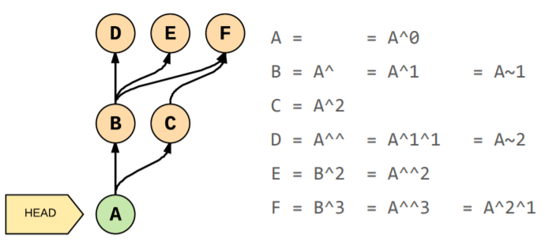

[FM Course Link](https://frontendmasters.com/courses/git-in-depth/)
[Code and Slides](https://github.com/nnja/advanced-git)

- research on github and gitlab shortcuts especially for code browsing
  - additionally, extensions like GitLab for VS Code (and do you want that)
[whats-inside-the-git-directory](https://blog.safia.rocks/post/171558325240/whats-inside-the-git-directory) [article]
[Deep Dive into Git](https://www.youtube.com/watch?v=fBP18-taaNw) [Must watch conference talk about GIT]
[ProGit Book](https://git-scm.com/book/en/v2)
[Understanding Git - Branching](https://hackernoon.com/understanding-git-branching-2662f5882f9)
[Collection of useful .gitignore templates](https://github.com/github/gitignore)

The section about git VCS
- [Git Foundations](#git-foundations)
- [Commands](#commands)
- [Search through History](#search-through-history)
  - [Log](#log)
  - [Show](#show)
  - [Diff - shows you changes](#diff---shows-you-changes)
- [Fixing Mistakes](#fixing-mistakes)
  - [How to recover Lost Work](#how-to-recover-lost-work)
- [Git Workflow](#git-workflow)
  - [Merge and Fast-Forward](#merge-and-fast-forward)
- [Configuration](#configuration)
- [.git](#git)
- [Data-model](#data-model)
- [Repository](#repository)
- [References - Pointers to Commits](#references---pointers-to-commits)
  - [3 Areas where code changes reside from GIT's point of view](#3-areas-where-code-changes-reside-from-gits-point-of-view)
- [Hints](#hints)
    - [Common Problems](#common-problems)
- [How to write commit messages](#how-to-write-commit-messages)

# Git Foundations
Git - Distributed VCS
- resembles key-value store
- value is the data, key is the hash of the data (sha1; 40-digit hexadecimal number)
  - hash returns the same output for the same input every time
    - therefore, you can't really change commits (since if you change any of the content it will give you different sha1)
    - this is really important to prevent all sorts of corupption problems
  - under the hood git hash is produced by `git hash-object` function

-❗ You can't store empty dirs in GIT
-❗ In git identical content is only stored once (and that is where git trees (as type of git objects) take the main role)
-❗ GIT objects are compressed (can't be direclty observed)
  - `git cat-file -t "hash-of-the-object"` (returns you the type of the object)
  - `git cat-file -p "hash-of-the-object"` (-p as pointer; returns you the content of the object)
  - if you do the upper command on the git object which is of type `tree` it will show you which files it contains, if you do it on object of type `blob` it will give you the actual content

# Commands
- The Git commands are just leaky abstractions over the data storage
- Essentially, a branch is just a text file (inside of .git/refs/) containing a checksum of the last commit on that branch, i.e., a pointer to the commit.

| Command                         |                                                    Description |
| ------------------------------- | -------------------------------------------------------------: |
| git branch                      |                                                                |
| git branch -D branch_name       |                                                  remove branch |
| git checkout -b new_branch_name |                                              create new branch |
| git checkout branch_name        |                                      switch to existing branch |
| git checkout                    |                                      switch to previous branch |
| git reset --hard <sha-id>       | take your code base to the state it was at time of some commit |
| git cherry-pick <sha-id>        |                                   borrow code from some commit |
| git reflog                      |                          helps to recover your project history |
| git gc                          |                           preserves all commits of all reflogs |

# Search through History

## Log
`git log` shows the history of your repository (uses pager to display list of commits)
- by default it is set to **less** (use `--no-pager` flag (needs to be in front of `log`))
- log has many useful flags which can be combined
- `git log --since="2 weeks ago"`
- `git log --name-status --follow -- <file>` git tracks that file and how it was changing
  - can be used to log files that have been moved or renamed,
- `git log -grep <regexp>` - search for commit messages that match a regular expression
- `git log --diff-filter=R --stat` - include/exclude files based on what kind of modification was done (A) - added, (D) - deleted, (M) - modified
- `git log --grep=mail --author=miki --since=2.weeks`
- `git log --all --graph --decorate` - show the log history in the form of directed graph

- How to reference Commits
  - `^` or `^n` (1st or nth parent commit) (e.g., in merges you usually have 2 parents, but you can have even more, and this is how you reference them)
  - `~` or `~n` (1st commit back following 1st parent and n commits back following only 1st parent)
  - `~` and `^` can be combined

## Show
- `git show <commit>`
- `git show <commit> --stat` show files changed in commit
- `git show <commit>:<file>` look at file from another commit

## Diff - shows you changes
- `git diff` what is changed between snapshots (between commits, or between a commit and staging area, or working area)
- e.g., `git diff 49fa51a3 hello.txt` compare hello.txt in staging area with one in the commit which hash starts with `49fa51a3`
  - double check this and check ther versions of the command ❓
  - `git diff HEAD hello.txt`
    - compare the hello.txt in the last commit with current working area
  - `git diff 49fa51a3 HEAD hello.txt`
    - - compare the hello.txt in the last commit with the content of the file in the `49fa51a3` commit
- `git diff` - unstaged changes (what could be in next commit )
- `git diff --staged` - staged changes (what will be in next commit)
  - important: git diff A B is not the same as git diff B A
  - you can use diff for branches
- `git branch --merged master` -  check which branches are merged with dev/master and maybe they can be cleaned up
- `git branch --no-merged master`

# Fixing Mistakes
- `checkout`
  - pulls data from repo to staging area (switching branches), but also from staging area to working area
    - 1.) Update HEAD pointer;
    - 2.) copies the commit snapshot to Staging Area;
    - 3.) copies the content to working area
  - `git checkout -` checkouts the previous branch
  - `git checkout -f <branch-name>` will force the checkout and overwrite existing changes (be careful)
    - `-f` - force overwriting of files
  - `git checkout <file-name>` throw away the changes made on the specific file
  - `git checkout -- file` - replace the working area with the version from the current staging area (i.e., it will discard unsaved changes and apply content from the last commit)
    - these "--" signify the end of the command operation and start of positional parameters
  - `git checkout <commit> -- file` will update the staging area to match the commit and then update the file in working area
      - this is extremely useful for restoring deleted files!
  - `git checkout <deleting_commit>^ -- <file_path>` (^ references the parent commit) - we find the commit where we deleted the file, then we find its parent and from there we retrieve the deleted file and put it back to staging and working areas
  - `git checkout -b <branch-name>` create and checkout new branch
- `reset` (important command... do research)
  - works differently for paths (ie, branches) and for commits
  - soft, mixed and hard
  - for commits: moves the head pointer and modifies file
    - soft: moves HEAD and the current branch
    - mixed: soft + reset staging area
    - hard: mixed + reset working area
- `revert`
  - fixes mistakes by creating opposite changes from the specified commit
  - the original commit stays in the repository
- `clean`
  - will remove untracked files
  - `--dry-run` to see what will be deleted
  - `-f` to do deletion
  - `-d` will clean dirs

- `amend`
  - this does not really rewrite previous commit, it actually creates a copy of it (and changes something) and moves pointer to that commit

- `git branch` creates new branch (but does not check it out)

## How to recover Lost Work
- ORIG_HEAD (commit where HEAD was pointing before reset or merge)
  - `git reset --merge ORIG_HEAD`
- If you need to go back in time and find a commit that is no longer referenced (i.e., dangling commit) you can look in reflog
  - it has slightly different syntax: HEAD@{2} means "the value of HEAD 2 moves ago"

`git commit -a` will commit all changes made on the file which are already being tracked by GIT
`git add :/` (or something like that) will add every change to the next commit
`git add -p` will ask you interactively to stage changes (it will ask you for each chunk of changes if you want to stage them, what is also available in UI)
  - `git diff --cached` will show you what changes are saved for commit

`git blame` who edited certain file

`git bisect` this is really interesting command... it looks like it changes your working area and checkouts one-commit after other
- eg, in case your test fails, but it was passing some time before and you are not sure when, and you want to check what commit is the first one where the test fails... or something like that
- ❓ maybe it does not do that... but it is definetly intended to do what I described in the use-case

# Git Workflow
- `git add <file>`
- `git rm <file>` - remove file in the next commit (this is like removing the file and staging that change)
- `git mv <file>` - rename a file in the next commit
- 🌟 `git add -p` - partial staging - allows you to stage commits in chunks and interactively (useful when you did to many changes for one commit)

## Merge and Fast-Forward
- merge commits are commits which have more than one parent (i.e., usually 2 parents development and feature branch)
  - merge commit is a marker when a new feature is merged into master/development
  - `git cat-file -p <sha1-of-commit>`
- fast-forward happens when there is a clear path how to update one branch to include changes from the other
  - by updating the pointer of the other branch to the pointer of the second branch they will have same commits and changes
    - `git merge --no-off` enforces merge commit, even when it is not necessary (it will not use fast-forward)
- ❓ research on how "git merge" works and how merge conflicts appear
- `git merge --abort` will put you in the state you were before you tried to merge (and got conflicts)
- `git add <file-name>` (once you resolve conflicts add files which were resolved to tell git they are fixed now (basically stage them in the new commit))
- `git merge --continue` once you resolve everything use this command to proceed
- `git rerere` - Reuse Recorded Resolution (git saves how you resolve a merge conflict and next time reuse the same resolution)
- `git mergetool` will open your default tool for resolving conflicts
  - eg, `vimdiff`

- `rebase`
  - give a commit a new parent (i.e., new base commit)
  - extremely powerful, research
    - here is one link [yt link](https://www.youtube.com/watch?v=f1wnYdLEpgI)
      - important, he does not use it really well, but comments are really good

# Configuration
You need to make sure that your commit credentials are stored in GitLab/GitHub as well
	- e.g., I had an issue that in my local git config I was using e-mail address mpetkovic@wps-management.de but in gitlab user-settings there was only mpetkovic@wescale.com and therefore my commits were not properly recognized
	- you can manage these settings in Gitlab here `GITLAB_SERVER/profile/emails` (e.g., https://gitlab.wescale.io/profile/emails)
    [link from the source of the answer](https://gitlab.com/gitlab-org/gitlab-foss/issues/21578)

- Configuration is stored in `./gitconfig`
  - Can be **global** or **per-project base**
  - ❓ is there a difference between **global** and **user config** settings
- `git config --global core.editor <YOUR_EDITOR>`

# .git
- Structure of the .git Directory:
  - objects/
    * contains objects/files which contain info about commits, files, directories
  - refs/
    * this is where git stores branch pointers
      - e.g., each branch points to its latest commit
  - HEAD points to currently active branch (or headless commit)
Where does Git store its data?
- `.git` dir
- `git init` will set up .git dir for new repository
  - in .git/objects it is where we store 3 types of git objects (blob)
    - inside each dir starts with 2 characters which are first 2 characters of hash (key) of each git object
- `git init --bare`❓

# Data-model
*[Understanding GIT - Data Model](https://hackernoon.com/https-medium-com-zspajich-understanding-git-data-model-95eb16cc99f5)* [ARTICLE]
- GIT generates 40-chars checksum hash for every object
  - first 2 chars are used for dir/ name and the rest (38 chars) for object file name
- 3 Types of Objects
  - BLOB Objects: contain a snapshot of the files and their checksum header
  - TREE Objects: contain a list of files with pointers to BLOB objects assigned to them
    - this is how git associates which file has which content at a given time
    - TREE Objects can be nested (they can point to other tree objects)
      - Think about it this way: Every BLOB represents a file and every TREE object represents a directory, so if we have nested directories we will have nested TREE Objects
  - COMMIT Objects: contain a reference to their TREE Objects
Git stores the data in 3 types of objects
1. Blob (stores compressed data (i.e., source code), along with some metadata in a header)
2. Tree - contains pointers (using sha1) to blobls and to other trees (because dirs can be nested)
   - Git stores filenames and directory structures info about blobs in a **tree**
   - additional metadata, mode (executable file, symbolic link, ...), type of pointer (blob or tree), filename or dir_name
     - trees are directed graphs; snapshots of the repository (point at files and dirs)
3. Commit - points to a tree and contains metadata: author, date, message, parent commit
   - Commit is a code snapshot (combination of the changes from the staging area and the previous commit)

# Repository
- When you clone remote repository (i.e., from gitlab, github) it checkouts by default the default branch (i.e., master or development)
- Where code lives:
  - Working Area - untracked files - files/changes not handled by git or not in your staging area
  - Staging Area (i.e., Cache, Index) - what changes will be in the next commit
    - Clean staging area is not empty! but it is rather an exact copy of your last commit
    - it is a binary file in .git/
    - ⭐ Git knows that some file is changed, because its SHA1 is now changed (i.e., sha1 of the new file is not the same as sha1 of the file in repo)
    - use `git ls-files -s` to see what is in staging area
  - Repository - files that Git knows about and it contains all your commits
- Stash - save un-commited work (safe from destructive operations)
  - useful for switching between branches while you are in the middle of work
  - by default git stashes only tracked files, if you want to include untracked you must specify it with flag `git stash --include-untracked`
    - `git stash --all` (kepp all files, even ignored)
  - useful commands
    - `git stash`; `git stash list`
    - `git stash show stash@{0}` - show the content
    - `git stash apply` apply the latest stash; `git stash apply stash@{0}` apply a specific stash;
    - `git stash save "some name"`
    - ❓❓❓ you can start branch from stash
    - `git checkout <stash-name> -- <filename>` grab single file from stash
    - `git stash pop` - remove the last stash and apply changes
    - `git stash drop` - remove the last stash; `git stash drop` stash@{n} - remove the nth stash;
    - `git stash clear` - removes all stashes
    - `git stash -p` to partially apply stash (similar to `git add -p`)

# References - Pointers to Commits
- stored in .git/refs
  - .git/refs/heads is where branches live (files there point to last commits of respective branches)
- 3 Types (tags, branches, HEAD - a pointer to the current branch/commit)
  - HEAD determines what will be the parent of the next commit (head usually points to the name of the current branch)
  - switching branches in git is fast because, it is essentially just changing the pointer
  - tags are like bookmarks (pointers to commits)
    - they can be lightweighted and annotated `git tag -a` (annotations add metadata like authors, ...)
    - tags are not automatically pushed to remote (you need to do it manually `git push --tags` (or something similar))
- Branch pointer moves with each new commit to the branch
  - tag is a snapshot, it does not change where it points to
  - tags are used for releases (e.g., v1.0, ...)
- Detached Head happens when we checkout some commit (which is not pointer to branch) and we make commits after them (now because they don't have the branch they are in detached head)
  - if we don't create branch for these commits they will become dangling commits once we checkout something else

## 3 Areas where code changes reside from GIT's point of view
*[Understanding GIT - Index](https://hackernoon.com/understanding-git-index-4821a0765cf)* [ARTICLE]
[Watch this YT lecture for better understanding](https://www.youtube.com/watch?v=xbLVvrb2-fY)
- Working Directory/Area
  - *project/*
  - All the changes you make will remain in the WD until you add them to the staging area (- git add ...)
- Staging Directory/Area (i.e., Index)
  - project/.git/index
  - preview area of the next commit
  - /index file keeps track of file changes which are related to staging area
    - this file is storing info about each file in the repository
      - mtime, file, wdir, stage, repo
- Repository
  - project/.git/objects
  - after the commit, the changes are saved as commit, blob and tree objects

# Hints
- When using git clone to to clone the project (from GitHub/GitLab) always use the small button *"copy URL"*
  - if you copy the URL manually, it often happens that it will include some empty space or something similar and the git clone command will fail
- Git Hooks https://githooks.com/
  - [How to use JS in git hooks](https://medium.com/@Sergeon/using-javascript-in-your-git-hooks-f0ce09477334)
  - [Basics](http://omerkatz.com/blog/2013/2/15/git-hooks-part-1-the-basics)
  - https://githooks.com/
- Git Secret
  - used for encryption of sensitive data in the repository (e.g., passwords, db-connection-strings)
  - [article](https://www.techrepublic.com/article/how-to-install-and-use-git-secret/)
### Common Problems
- [How to push to GitHub through HTTPS when you have 2-factor authentication enabled?](https://mycyberuniverse.com/how-fix-fatal-authentication-failed-for-https-github-com.html)
  - This happens once 2-factor authentication is enabled.
  - TL;DR; The solution is to create personal access token which will be used instead of the password to authenticate your account
  - **Even Better: Use only SSH.**

- Line Endings
  - ⭐[Mind the end of your line](http://web.archive.org/web/20150912185006/http:/adaptivepatchwork.com:80/2012/03/01/mind-the-end-of-your-line/)
    - article about how to configure git to handle line endings LF - CRLF
  - [SO - Force LF EOL in git repo and working copy](https://stackoverflow.com/questions/9976986/force-lf-eol-in-git-repo-and-working-copy)
    - read the first answer till the end! actually the config from the second answer is used
  - [.gitattributes](https://git-scm.com/docs/gitattributes)
  - If a file is unspecified then Git falls back to the core.autocrlf setting and you are back in the old system.
		* you added .gitattributes to prevent LF conversion to CRLF and especially to prevent that CRLF enters into repo
		* Set your global configuration file
			* git config --global core.autocrlf input
	* Additionally use .editorconfig (and related plugins) to ensure that LF is always used over CRLF
  - check this [SO Question](https://stackoverflow.com/questions/2517190/how-do-i-force-git-to-use-lf-instead-of-crlf-under-windows/13154031#13154031) for how to configure EOL in Windows

# How to write commit messages
- Add the body of the message after new line when the commit is bigger (not just the first line using -m "...")
- Commit message is in **future tense**. 'Fix' vs 'Fixed'
  - That is a short subject followed by a blank line
  - After that follows a description of the current behavior, a short summary of why the **fix** is needed. Mention side-effects
  - Description should be broken into 72 char lines
